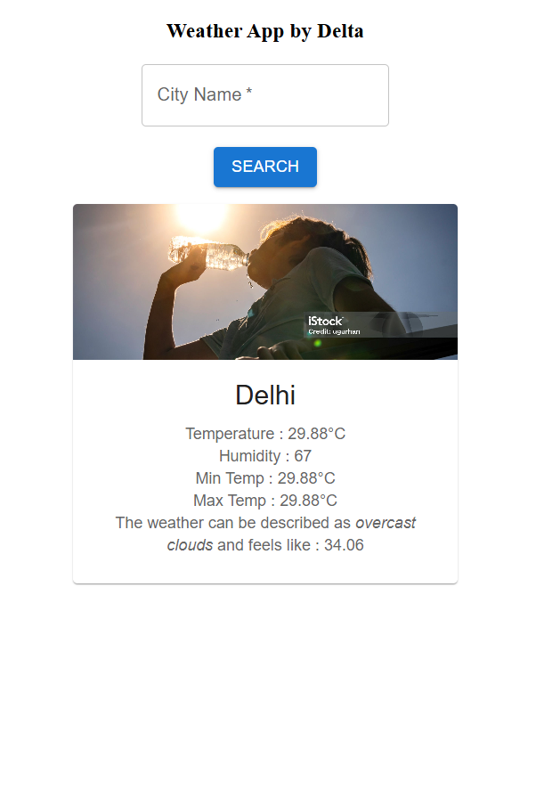

# 🌤️ Weather Widget App

A simple and responsive weather widget built using React. It fetches real-time weather data and displays it based on the entered city name.

---

## 📸 Screenshot



---

## 🛠️ Tech Stack

- React JS
- CSS
- OpenWeatherMap API (or whichever API you used)

---

## 📦 Installation

Follow these steps to run the project locally:

```bash
1. Clone the repository
2. Open terminal and run: npm install
3. Then run: npm start